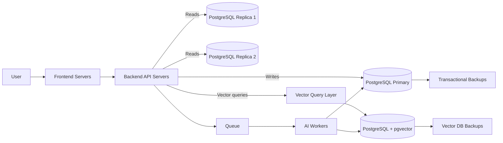

# siera-ai
Complete reference project for an AI system with:
- Frontend and backend on separate servers
- PostgreSQL transactional cluster (1 primary + 2 read replicas)
- Separate PostgreSQL + pgvector database
- Management scripts for lifecycle, replication checks, backup/restore, and failover workflows

## Architecture diagram


## Directory structure
```text
siera-ai/
├── .env.example
├── docker-compose.yml
├── README.md
├── backups/
├── docs/
│   ├── ARCHITECTURE.md
│   ├── DEPLOYMENT_AND_SERVER_SPECS.md
│   ├── MANUAL_ALTERATIONS.md
│   └── TESTING_AND_VALIDATION.md
├── scripts/
│   ├── backup.sh
│   ├── init.sh
│   ├── lib.sh
│   ├── manage.sh
│   ├── promote_replica.sh
│   ├── rebuild_replica.sh
│   ├── restore.sh
│   ├── start.sh
│   ├── status.sh
│   ├── stop.sh
│   ├── test_replication.sh
│   └── test_vector.sh
├── sql/
│   ├── 01_app_init.sql
│   └── 02_vector_init.sql
└── tests/
    └── run_all.sh
```

## Quick start
1. Copy env template:
   `cp .env.example .env`
2. Set passwords in `.env`.
3. Make scripts executable:
   `chmod +x scripts/*.sh tests/*.sh`
4. Initialize:
   `./scripts/manage.sh init`
5. Run full validation:
   `./tests/run_all.sh`

## Main commands
- `./scripts/manage.sh status`
- `./scripts/manage.sh test-replication`
- `./scripts/manage.sh test-vector`
- `./scripts/manage.sh backup`
- `./scripts/manage.sh restore --app <app_dump> --vector <vector_dump>`
- `./scripts/manage.sh promote replica1|replica2`
- `./scripts/manage.sh rebuild replica1|replica2`

## Documentation
- `docs/ARCHITECTURE.md`
- `docs/DEPLOYMENT_AND_SERVER_SPECS.md`
- `docs/MANUAL_ALTERATIONS.md`
- `docs/TESTING_AND_VALIDATION.md`

