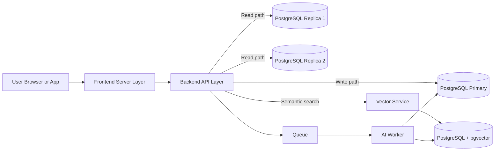

# Architecture and script workflow
## Graphical architecture

## What we are doing
1. Keep application OLTP data in transactional Postgres.
2. Scale reads using two replicas.
3. Keep vector embeddings/search in separate pgvector cluster.
4. Provide scripted operations for startup, health checks, tests, backup/restore, and failover tasks.

## Why this design
- Prevents vector workloads from degrading transactional latency.
- Supports horizontal read scaling.
- Improves reliability with controlled promotion and replica rebuild operations.
- Keeps operations repeatable and auditable using scripts.

## Script map (how scripts connect to architecture)
- `scripts/init.sh`: boot all DB nodes and wait for readiness.
- `scripts/status.sh`: inspect replication and vector extension health.
- `scripts/test_replication.sh`: validate write-on-primary/read-on-replicas.
- `scripts/test_vector.sh`: validate pgvector ingestion and similarity query.
- `scripts/backup.sh`, `scripts/restore.sh`: data protection and recovery.
- `scripts/promote_replica.sh`: failover promotion action.
- `scripts/rebuild_replica.sh`: recreate broken/outdated replica from primary.

